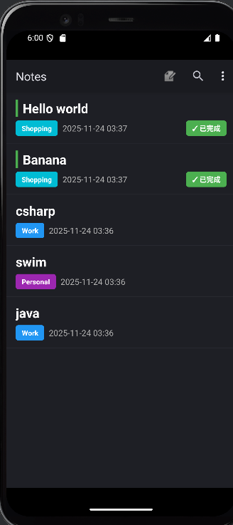
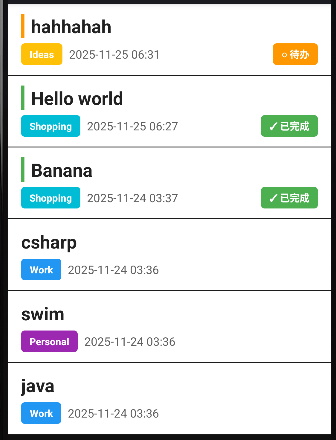
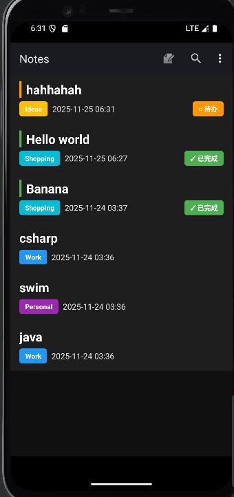
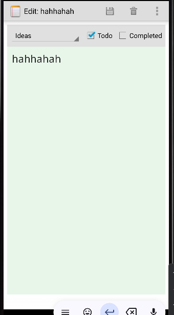
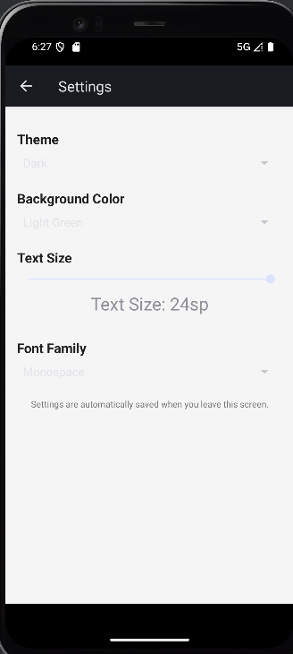
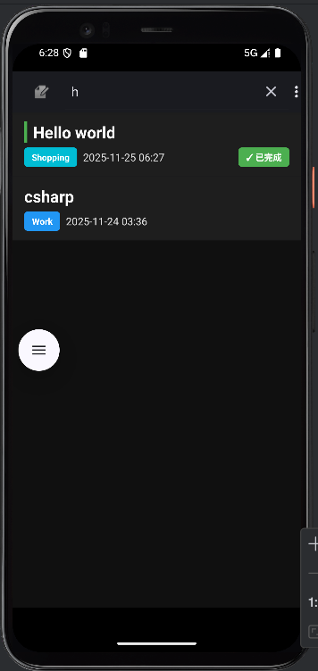
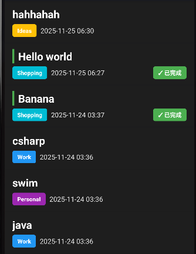

# NotePad - 增强版记事本应用

<div align="center">


一个功能丰富、界面美观的Android记事本应用，支持笔记管理、分类、待办事项、搜索和个性化设置。

</div>

---

## 📋 目录

- [项目简介](#项目简介)
- [功能特性](#功能特性)
- [技术栈](#技术栈)
- [项目结构](#项目结构)
- [功能详解](#功能详解)
- [技术实现](#技术实现)
- [界面展示](#界面展示)
- [使用指南](#使用指南)


---

## 📱 项目简介

NotePad是一个基于Android平台的增强版记事本应用，在原有基础功能上进行了全面升级和优化。应用采用ContentProvider架构，支持笔记的创建、编辑、删除、搜索等基本操作，并新增了分类管理、待办事项、个性化设置等扩展功能，为用户提供更加便捷和个性化的笔记管理体验。

### 核心特点

- ✅ **完整的笔记管理**：支持笔记的增删改查操作
- 🏷️ **智能分类系统**：支持多种分类标签，便于笔记组织
- ✅ **待办事项管理**：支持待办事项的创建和完成状态跟踪
- 🔍 **强大的搜索功能**：支持标题和内容全文搜索
- 🎨 **个性化定制**：支持主题、背景色、字体等个性化设置
- 📅 **时间戳显示**：清晰显示笔记创建和修改时间
- 💾 **数据持久化**：基于SQLite数据库，数据安全可靠

---

## ✨ 功能特性

### 基本功能

#### 1. 笔记管理
- **创建笔记**：快速创建新笔记
- **编辑笔记**：支持标题和内容的编辑
- **删除笔记**：支持单条和批量删除
- **查看笔记**：列表视图展示所有笔记
- **复制粘贴**：支持笔记的复制和粘贴操作

#### 2. 时间戳显示
- 在笔记列表中显示修改时间
- 时间格式：`yyyy-MM-dd HH:mm`
- 自动更新修改时间

#### 3. 搜索功能
- 实时搜索：输入关键词即时过滤
- 全文搜索：同时搜索标题和内容
- 模糊匹配：支持部分关键词匹配

### 扩展功能

#### 1. 笔记分类系统
支持以下分类：
- **None（无分类）**：默认分类
- **Work（工作）**：工作相关笔记
- **Personal（个人）**：个人生活笔记
- **Ideas（想法）**：创意和想法
- **Shopping（购物）**：购物清单
- **Important（重要）**：重要事项

**特点：**
- 每个分类使用不同颜色标识
- 分类标签在列表中醒目显示
- 支持分类筛选（可扩展）

#### 2. 待办事项功能
- **待办标记**：将笔记标记为待办事项
- **完成状态**：跟踪待办事项的完成情况
- **视觉指示**：
  - 待办中：橙色指示条和标签
  - 已完成：绿色指示条和标签
- **状态切换**：快速切换待办状态

#### 3. 个性化设置
支持以下个性化选项：

**主题设置：**
- Light（浅色主题）
- Dark（深色主题）

**背景颜色：**
- White（白色）
- Light Gray（浅灰色）
- Beige（米色）
- Light Blue（浅蓝色）
- Light Green（浅绿色）

**文本设置：**
- 字体大小：14-24sp可调节
- 字体类型：Default、Serif、Sans-serif、Monospace

**特点：**
- 设置实时生效
- 自动保存用户偏好
- 支持多主题切换

#### 4. UI美化优化
- **现代化界面设计**：采用Material Design风格
- **深色主题支持**：护眼的深色模式
- **彩色标签系统**：分类和待办状态使用醒目的彩色标签
- **优化的布局**：合理的间距和排版
- **高对比度文字**：白色文字在深色背景下清晰可见

---

## 🛠️ 技术栈

### 核心技术
- **开发语言**：Java
- **开发平台**：Android SDK
- **最低支持版本**：Android 3.0 (API 11)
- **目标版本**：Android 6.0 (API 23)
- **构建工具**：Gradle

### 架构组件
- **ContentProvider**：数据提供者，实现数据共享
- **SQLite数据库**：本地数据存储
- **CursorAdapter**：数据绑定和列表展示
- **SharedPreferences**：用户偏好设置存储

### 主要技术点
- ContentProvider数据访问模式
- SQLite数据库操作和升级
- Cursor管理和数据绑定
- 自定义View和布局
- 菜单和上下文菜单
- 搜索功能实现
- 主题和样式定制

---

## 📁 项目结构

```
NotePad-main/
├── app/
│   ├── src/
│   │   ├── main/
│   │   │   ├── java/com/example/android/notepad/
│   │   │   │   ├── NotePad.java              # 数据契约类
│   │   │   │   ├── NotePadProvider.java      # 数据提供者
│   │   │   │   ├── NotesList.java            # 笔记列表Activity
│   │   │   │   ├── NoteEditor.java           # 笔记编辑Activity
│   │   │   │   ├── SettingsActivity.java     # 设置Activity
│   │   │   │   ├── TitleEditor.java          # 标题编辑Activity
│   │   │   │   └── NotesLiveFolder.java      # Live Folder支持
│   │   │   ├── res/
│   │   │   │   ├── layout/
│   │   │   │   │   ├── noteslist_item.xml     # 笔记列表项布局
│   │   │   │   │   ├── note_editor.xml        # 笔记编辑布局
│   │   │   │   │   └── settings.xml           # 设置界面布局
│   │   │   │   ├── menu/
│   │   │   │   │   ├── list_options_menu.xml  # 列表菜单
│   │   │   │   │   ├── list_context_menu.xml  # 上下文菜单
│   │   │   │   │   └── editor_options_menu.xml # 编辑菜单
│   │   │   │   ├── values/
│   │   │   │   │   ├── strings.xml            # 字符串资源
│   │   │   │   │   └── arrays.xml             # 数组资源
│   │   │   │   └── drawable/
│   │   │   │       ├── category_badge.xml     # 分类标签背景
│   │   │   │       ├── todo_badge.xml          # 待办标签背景
│   │   │   │       └── todo_completed_badge.xml # 完成标签背景
│   │   │   └── AndroidManifest.xml            # 应用清单文件
│   │   └── androidTest/                       # 测试代码
│   └── build.gradle                           # 构建配置
├── build.gradle                               # 项目构建配置
├── settings.gradle                            # 项目设置
└── README.md                                  # 项目说明文档
```

---

## 🔧 功能详解

### 1. 笔记列表界面（NotesList）

**主要功能：**
- 显示所有笔记的列表
- 支持点击进入编辑
- 支持长按显示上下文菜单
- 支持搜索过滤

**界面元素：**
- **标题栏**：显示"Notes"标题，包含添加、搜索、设置按钮
- **笔记列表**：每个笔记项显示：
  - 笔记标题（白色粗体）
  - 修改时间（浅灰色）
  - 分类标签（彩色圆角标签）
  - 待办状态（左侧指示条 + 右侧状态标签）

**操作方式：**
- **点击笔记**：进入编辑界面
- **长按笔记**：显示上下文菜单（打开、复制、删除）
- **点击添加按钮**：创建新笔记
- **点击搜索图标**：展开搜索框
- **点击设置图标**：进入设置界面

### 2. 笔记编辑界面（NoteEditor）

**主要功能：**
- 编辑笔记标题和内容
- 设置笔记分类
- 标记为待办事项
- 设置待办完成状态

**界面布局：**
- **顶部工具栏**：分类选择器、待办复选框、完成状态复选框
- **编辑区域**：带行线的文本编辑器

**功能说明：**
- **分类选择**：下拉菜单选择笔记分类
- **待办标记**：勾选"Todo"将笔记标记为待办
- **完成状态**：待办笔记可标记为已完成
- **自动保存**：离开界面时自动保存

### 3. 设置界面（SettingsActivity）

**主要功能：**
- 主题选择
- 背景颜色设置
- 文本大小调节
- 字体类型选择

**设置项说明：**
- **主题**：Light/Dark主题切换
- **背景颜色**：5种背景颜色可选
- **文本大小**：滑动条调节，范围14-24sp
- **字体类型**：4种字体可选

**特点：**
- 设置实时预览
- 自动保存到SharedPreferences
- 退出时自动应用设置

### 4. 搜索功能

**实现方式：**
- 使用SearchView组件
- 实时过滤列表
- 数据库LIKE查询

**搜索范围：**
- 笔记标题
- 笔记内容

**使用步骤：**
1. 点击列表界面右上角的搜索图标
2. 在搜索框中输入关键词
3. 列表实时过滤显示匹配的笔记
4. 清空搜索框恢复显示所有笔记

---

## 💻 技术实现

### 1. 数据库设计

**表结构：notes**

| 字段名 | 类型 | 说明 |
|--------|------|------|
| _id | INTEGER | 主键，自增 |
| title | TEXT | 笔记标题 |
| note | TEXT | 笔记内容 |
| created | INTEGER | 创建时间戳 |
| modified | INTEGER | 修改时间戳 |
| category | TEXT | 分类（新增） |
| is_todo | INTEGER | 是否为待办（新增） |
| todo_completed | INTEGER | 待办完成状态（新增） |

**数据库升级：**
- 版本1→2：初始版本
- 版本2→3：添加category、is_todo、todo_completed字段

```java
// 数据库升级实现
@Override
public void onUpgrade(SQLiteDatabase db, int oldVersion, int newVersion) {
    if (oldVersion < 3) {
        // 添加新列而不删除旧数据
        db.execSQL("ALTER TABLE notes ADD COLUMN category TEXT DEFAULT ''");
        db.execSQL("ALTER TABLE notes ADD COLUMN is_todo INTEGER DEFAULT 0");
        db.execSQL("ALTER TABLE notes ADD COLUMN todo_completed INTEGER DEFAULT 0");
    }
}
```

### 2. ContentProvider实现

**核心方法：**
- `query()`：查询笔记数据
- `insert()`：插入新笔记
- `update()`：更新笔记
- `delete()`：删除笔记
- `getType()`：返回MIME类型

**URI匹配：**
- `content://com.google.provider.NotePad/notes`：所有笔记
- `content://com.google.provider.NotePad/notes/#`：单个笔记

### 3. 列表适配器优化

**自定义SimpleCursorAdapter：**
- 重写`getView()`方法自定义列表项显示
- 动态设置分类标签颜色
- 显示待办状态指示器
- 格式化时间戳显示

**关键代码：**
```java
SimpleCursorAdapter adapter = new SimpleCursorAdapter() {
    @Override
    public View getView(int position, View convertView, ViewGroup parent) {
        View view = super.getView(position, convertView, parent);
        // 设置分类标签
        // 设置待办状态
        return view;
    }
};
```

### 4. 搜索功能实现

**实现方式：**
- 使用FilterQueryProvider接口
- 动态构建SQL查询语句
- 实时更新Cursor

**查询逻辑：**
```java
String selection = "(title LIKE ? OR note LIKE ?)";
String[] selectionArgs = {"%" + keyword + "%", "%" + keyword + "%"};
```

### 5. 设置功能实现

**存储方式：**
- 使用SharedPreferences存储用户偏好
- 键值对形式存储各项设置

**应用设置：**
- 在NoteEditor中读取设置
- 动态设置背景色、字体大小、字体类型

---

## 🎨 界面展示

### 主界面（笔记列表）

**界面特点：**
- 深色主题背景
- 白色标题文字，清晰醒目
- 彩色分类标签，易于识别
- 待办状态指示条，一目了然

**界面元素说明：**
1. **顶部操作栏**：
   - 左侧：应用标题 "Notes"
   - 右侧：添加按钮（➕）、搜索按钮（🔍）、设置菜单（⋮）

2. **笔记列表项**：
   - 左侧：待办指示条（4dp宽，橙色=待办，绿色=已完成）
   - 标题行：笔记标题（白色粗体，16sp）
   - 信息行：
     - 分类标签（彩色圆角标签，12sp）
     - 时间戳（浅灰色，12sp）
     - 待办状态标签（右侧，橙色/绿色）

**布局示意图：**
```



```

**截图说明：**
- 应展示深色主题下的笔记列表
- 显示多个笔记项，包含不同分类和待办状态
- 展示分类标签的颜色区分
- 展示待办指示条的视觉效果

### 编辑界面

**界面特点：**
- 顶部工具栏：分类选择、待办选项
- 带行线的编辑器
- 支持自定义背景色和字体

**界面元素说明：**
1. **顶部工具栏**（灰色背景）：
   - 分类下拉选择器（左侧）
   - Todo复选框（中间）
   - Completed复选框（右侧，仅待办时显示）

2. **编辑区域**：
   - 带行线的文本编辑器
   - 支持多行输入
   - 自动换行

**布局示意图：**
```

```

**截图说明：**
- 展示编辑界面的完整布局
- 显示工具栏中的分类和待办选项
- 展示带行线的编辑器效果
- 可展示不同背景颜色设置的效果

### 设置界面

**界面特点：**
- 清晰的分类设置项
- 滑动条调节文本大小
- 下拉菜单选择选项
- 实时预览效果

**设置项说明：**
1. **Theme（主题）**：下拉选择 Light/Dark
2. **Background Color（背景颜色）**：下拉选择5种颜色
3. **Text Size（文本大小）**：滑动条调节，显示当前值
4. **Font Family（字体类型）**：下拉选择4种字体

**布局示意图：**
```

```

**截图说明：**
- 展示设置界面的完整布局
- 显示所有设置选项
- 展示滑动条的交互效果
- 可展示不同设置组合的效果

### 搜索功能界面

**界面特点：**
- 搜索框展开在标题栏
- 实时过滤结果
- 高亮显示匹配项

**布局示意图：**
```

```

**截图说明：**
- 展示搜索框展开状态
- 显示搜索结果列表
- 展示搜索关键词的匹配效果

### 分类标签颜色说明

**分类颜色映射：**
- **Work（工作）**：蓝色 (#2196F3)
- **Personal（个人）**：紫色 (#9C27B0)
- **Ideas（想法）**：琥珀色 (#FFC107)
- **Shopping（购物）**：青色 (#00BCD4)
- **Important（重要）**：红色 (#F44336)
- **默认**：深橙色 (#FF5722)

**布局示意图：**
```

```

**截图说明：**
- 展示不同分类标签的颜色效果
- 展示标签的圆角样式
- 展示标签在列表中的位置

### 待办状态视觉说明

**状态指示：**
- **待办中**：
  - 左侧指示条：橙色 (#FF9800)
  - 右侧标签：橙色背景，显示"○ 待办"
  
- **已完成**：
  - 左侧指示条：绿色 (#4CAF50)
  - 右侧标签：绿色背景，显示"✓ 已完成"

**布局示意图：**
```

```

**截图说明：**
- 对比展示待办中和已完成的视觉效果
- 展示指示条和标签的配合效果
- 展示不同状态下的颜色区分

---


## 📖 使用指南

### 创建笔记

1. 打开应用，进入笔记列表界面
2. 点击右上角的"➕"按钮
3. 在编辑界面输入笔记内容
4. 选择分类（可选）
5. 标记为待办（可选）
6. 退出界面自动保存

### 编辑笔记

1. 在列表中找到要编辑的笔记
2. 点击笔记项进入编辑界面
3. 修改内容、分类或待办状态
4. 退出界面自动保存

### 删除笔记

**方法一：**
1. 长按要删除的笔记
2. 在上下文菜单中选择"Delete"

**方法二：**
1. 进入笔记编辑界面
2. 点击菜单中的"Delete"选项

### 搜索笔记

1. 点击列表界面右上角的搜索图标（🔍）
2. 在搜索框中输入关键词
3. 列表自动过滤显示匹配的笔记
4. 清空搜索框恢复显示所有笔记

### 设置个性化选项

1. 点击列表界面右上角的设置图标（⋮）
2. 选择"Settings"进入设置界面
3. 调整各项设置：
   - 选择主题
   - 选择背景颜色
   - 调节文本大小
   - 选择字体类型
4. 退出设置界面，设置自动保存并应用

### 使用分类功能

1. 创建或编辑笔记时
2. 在顶部工具栏选择分类下拉菜单
3. 选择相应的分类
4. 保存后，分类标签会在列表中显示

### 使用待办功能

1. 创建或编辑笔记时
2. 勾选"Todo"复选框，将笔记标记为待办
3. 如果是待办事项，可以勾选"Completed"标记为已完成
4. 待办状态会在列表中通过颜色和标签显示

---


<div align="center">

**感谢使用 NotePad 增强版记事本应用！** 📝✨


[返回顶部](#notepad---增强版记事本应用)

</div>
